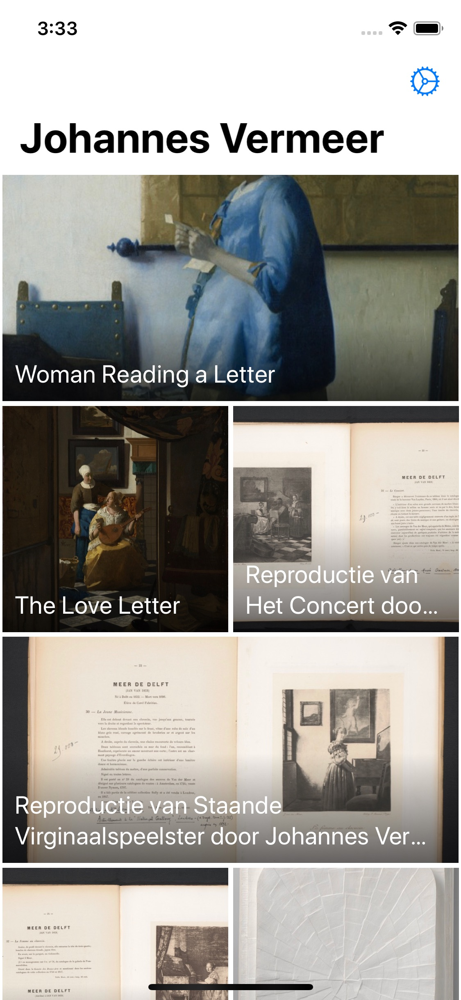
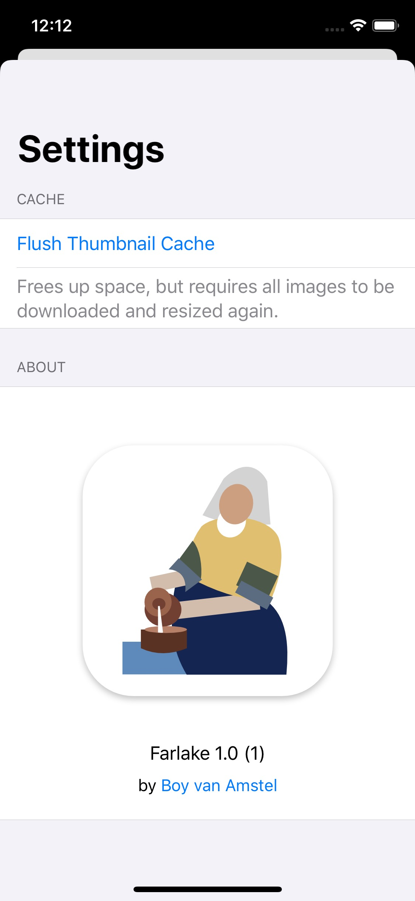
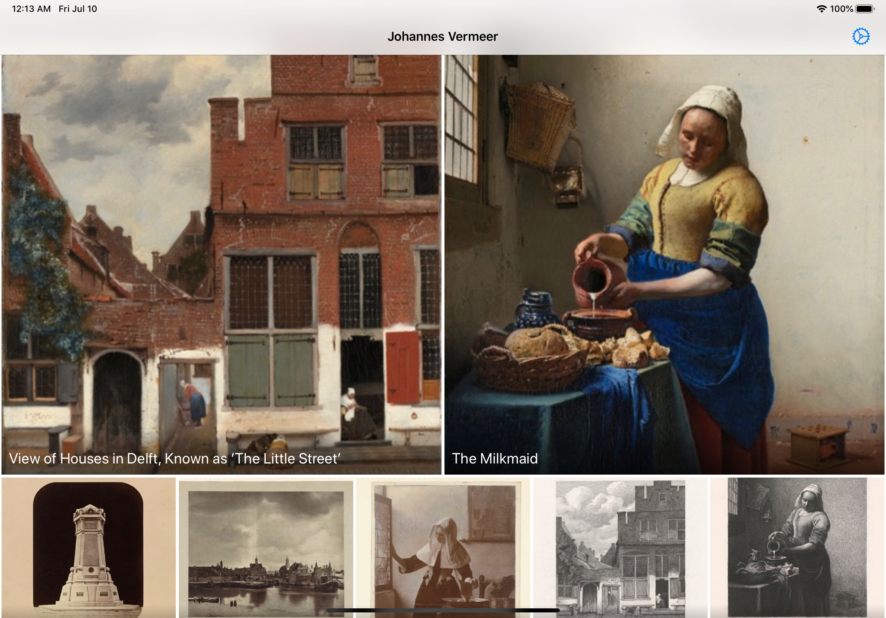
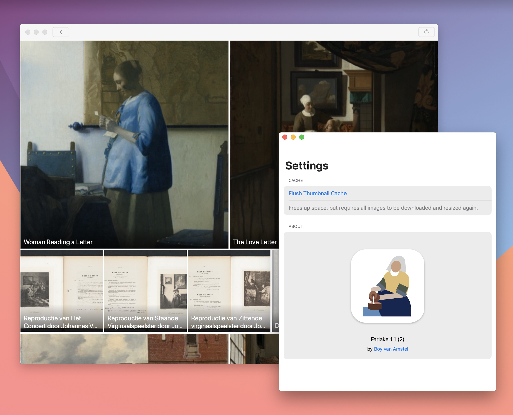

<div align="center"></div>

# Farlake

 [](https://app.bitrise.io/app/30371fd65c43253b)

Farlake is a small demo application that ties together Coordinators, MVVM, Catalyst, SwiftUI, UICollectionViewDiffableDataSource, UICollectionViewCompositionalLayout, NSCache, URLCache and a few other things to display art by Johannes Vermeer.

The content is made available by [Het Rijksmuseum](https://rijksmuseum.nl) through [their API](https://data.rijksmuseum.nl).

## Setup

### Clone the project

```
git clone git@github.com:boyvanamstel/Farlake.git
cd Farlake
```

### Bootstrap

Either build the project once, or run the included script to create `Farlake/Shared/Configuration/SecretConstants.swift`. It holds the Rijksmuseum API key that you'll need to supply.

```
./script/bootstrap
```

The script copies `SecretConstants-example.swift` to `SecretConstants.swift`. This allows me to open source the project without including any sensitive data.

### API key

Visit [the Rijksmuseum API page](https://data.rijksmuseum.nl/object-metadata/api/) to register for an API key. Add it to `Farlake/Shared/Configuration/SecretConstants.swift`:

```swift
struct SecretConstants {
    static let apiKey = "[your key]"
}
```

### Consistency

[`SwiftLint`](https://github.com/realm/SwiftLint) is used to enforce Swift style and conventions.

Most classes are marked as `final` to discourage subclassing and get a tiny performance win.

## Overview

This is broadly how the project is structured:

```
Farlake/
|-- iOS/                                    *iOS specific files*
|-- macOS/                                  *macOS specific files*
|-- Shared/                                 *The bulk of the project*
|   |-- Configuration/                      *Constants and secrets*
|   |-- Models/                             *Codable models*
|   |-- Utilities/                          *Extensions and tools*
|   |-- Services/                           *Networking and caching*
|   |   |-- ServicesProvider.swift          *Dependency injection*
|   |-- Components/                         *Reusable generic (UI) components*
|   |-- Features/                           *Self contained features of the app*
|   |   |-- Settings/                       *Everything for Settings*
|   |   |-- Gallery/                        *Everything for the Gallery*
|   |   |   |-- Views/                      *Views and View Models*
|   |   |   |-- Utilities/                  *Helpers specifically for the Gallery*
|   |   |   |-- GalleryCoordinator.swift    *One of the child Coordinators*
|   |-- Resources/                          *Assets, localization, Info.plist*
|   |-- Base/                               *Base protocols*
|   |-- System/                             *AppDelegate and UIWindowSceneDelegate*
|   |   |-- MainSceneCoordinator.swift      *The main Coordinator*
|   |   |-- TestCoordinator.swift           *UI Test Coordinator*
FarlakeTests/
FarlakeUITests/
```
### Startup

The `AppDelegate` retains a default set of services through `ServicesProvider.createDefaultProvider()`. These dependencies are injected into the main coordinators, which in turn pass them to any child coordinators and view models that need them.

A seperate set of dependencies gets created when running UI tests. More on that later.

#### Catalyst

There are two `UIWindowSceneDelegate`s, one for the main app and one for the Preferences window on Catalyst. I manually associated the `ServicesProvider` in an extension on `UISceneSession` (`UISceneSession+Helpers.swift`) to make sure both windows use the same networking and caching dependencies.

## Coordinators

### Main

```
Farlake/
|-- macOS/
|   |-- System/
|-- Shared/
|   |-- System/
```

The `MainSceneCoordinator` creates a child coordinator to display the gallery. It also makes sure the thumbnail cache is persisted to disk when the app is sent to the background (or the window is closed on Catalyst).

### Gallery

```
Farlake/
|-- Shared/
|   |-- Features/
|   |   |-- Gallery/
```

The `MainSceneCoordinator` loads the `GalleryViewController` which is a subclass of `UICollectionViewController`. It can also show settings on iOS and iPadOS.

### Settings

```
Farlake/
|-- macOS/
|   |-- Features
|   |   |-- Settings/
|-- Shared/
|   |-- Features/
|   |   |-- Settings/
```

Exists in two variants: `SettingsCoordinator` and `CatalystSettingsCoordinator`. The latter gets created by the `SettingsSceneDelegate` when a new window is opened on Catalyst.

## Features

```
Farlake/
|-- Shared/
|   |-- Features/
```

All view models use `Combine` publishers for their bindings.

### Gallery

The gallery collection view uses a compositional layout (`UICollectionViewLayout+Gallery.swift`) that adjusts its layout based on the size of the screen. I use a `UICollectionViewDiffableDataSource` to provide the content for the collection view. Farlake is definitely not pushing the envelope on diffable content, but the API is very convenient.

Errors are presented as alerts. The main benefit is that they get presented as sheets on Catalyst.

The navigation view is hidden on Catalyst.

### Settings

The settings view is built using `SwiftUI`. This is where the changes to Catalyst announced at WWDC20 would come in handy.

## Networking

```
Farlake/
|-- Shared/
|   |-- Services/
|   |   |-- Networking/
```

I use a base `NetworkService` that is then adopted by the `RijksmuseumNetworkService` and `ImageFetcher` to retrieve their `Resource<Object>`s. The `NetworkService` can be extended by complying to various protocols like `URLCaching`. More on that later.

Resources are parsed into `Decodable` models.

## Caching

```
Farlake/
|-- Shared/
|   |-- Services/
|   |   |-- Cache/
```

This was an interesting part to work on. The API layer and the image fetcher both rely on standard `URLSession`s with an aggressive caching configuration.

### `URLCache`

```swift
// Farlake/Shared/Services/Networking/Images/ImageFetcher.swift

let configuration: URLSessionConfiguration = .default
configuration.requestCachePolicy = .returnCacheDataElseLoad
```

By using [`.returnCacheDataElseLoad](https://developer.apple.com/documentation/foundation/nsurlrequest/cachepolicy/returncachedataelseload#), the response will always come from the first request that was made. This setting is applied to the API calls and when images are downloaded.

I wasted quite some time figuring out why caching wasn't reliable, until I figured out the order of the url parameters matters:

```swift
// Farlake/Shared/Utilities/URLRequest+Helpers.swift

guard var components = URLComponents(url: url, resolvingAgainstBaseURL: false) else {
    return nil
}
components.queryItems = parameters.keys
    .map { URLQueryItem(name: $0, value: parameters[$0]?.description) }
    .sorted { $0.name < $1.name } // Sort to ensure caching works
```

### `NSCache`

To ensure smooth scrolling the original (huge) images are resized and then stored in memory by a custom `ImageDataCache`, based on [an example by John Sundell](https://www.swiftbysundell.com/articles/caching-in-swift/).

The thumbnails are referenced by their url and the chosen thumbnail size. Multiple thumbnail sizes can be cached that way.

Because the entire cached is `Codable`, it can easily be stored on disk when the app is sent to the background and retrieved when the app launches.

One interesting implementation detail of using `NSCache` is that you'll need to make sure it doesn't get flushed when the app is sent to the background by implementing `NSDiscardableContent`.

```swift
private extension Cache {
    final class Entry: NSObject, NSDiscardableContent {
        ...

        // Keep entries around after entering background state
        // by overriding NSDiscardableContent
        func beginContentAccess() -> Bool { true }
        func endContentAccess() {}
        func discardContentIfPossible() {}
        func isContentDiscarded() -> Bool { false }
    }
}
```

### Flushing

The `URLCache` gets flushed by setting `request.cachePolicy = .reloadRevalidatingCacheData` on the resource that needs to be refreshed.

The image data cache can be cleared from the settings screen.

## Responder chain

The responder chain came in handy when implementing gallery refreshing and presenting the settings screen. Both can be called from completely different locations in the app, especially on Catalyst.

There's a refresh button in the toolbar on Catalyst and a menu item that can trigger a refresh, which even has a keyboard shortcut ( ⌘ + R). They all pass their request up the responder chain until it gets picked up by an object that conforms to matching the protocol. `GalleryViewController` in this case.

```swift
// Farlake/macOS/System/MainSceneDelegate+Catalyst.swift

@objc private func refreshButtonTapped(_ sender: UIButton) {
    // Use the responder chain to find a view that can handle the action
    UIApplication.shared.sendAction(#selector(GalleryRefreshableAction.refreshGallery), to: nil, from: sender, for: nil)
}

// Farlake/Shared/Features/Gallery/Views/GalleryViewController.swift

extension GalleryViewController: GalleryRefreshableAction {
    @objc func refreshGallery() {
        viewModel?.updateItems()
    }
}
```

## Testing

UI testing is managed by a dedicated `TestCoordinator` that uses  `CommandLine.argument` to put the app in the required state.

Various dependencies are replaced by mocked counterparts like the `MockRijksmuseumNetworkService`. Fixtures are used for unit testing.

## Improvements

Things that I didn't quite get to, or could be improved:

* Localization needs to be more consistently used.
* The `GalleryViewController` is starting to get a little heavy.
* UI test helpers could be moved into a dedicated helper class.
* Features: search and infinite scroll

## Screenshots

### iOS

<p float="left">
<a href="Screenshots/iphone-gallery.jpg"></a>
<a href="Screenshots/iphone-settings.jpg"></a>
</p>

### iPadOS

<a href="Screenshots/ipad-gallery.jpg"></a>

### macOS

<a href="Screenshots/macos.jpg"></a>

## License

`MIT`, but don't submit this to the App Store as is.
